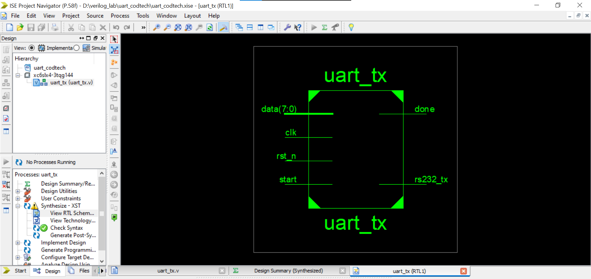
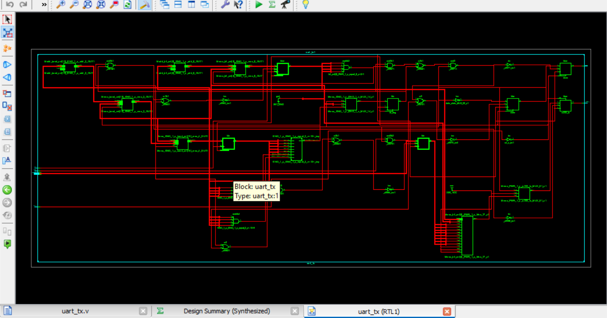
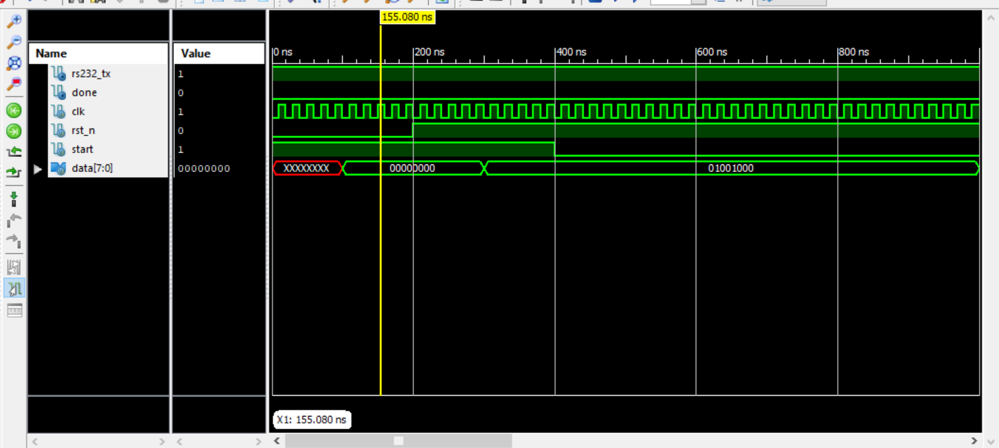
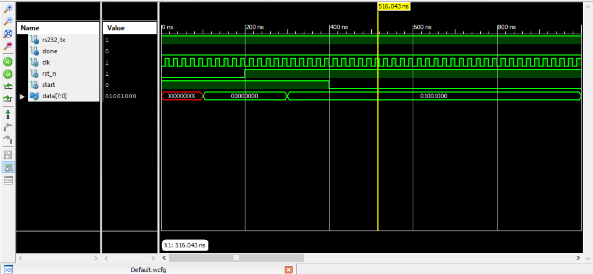

# CODTECH TASK 2
**Name:** Apoorva Amargol

**Company:** CODTECH IT SOLUTIONS

**ID:** CT08DS6751

**Domain:** VLSI

**Duration:** AUGUST to SEPTEMBER (2024)

**Mentor:** 

________
  Overview of the task 2: implementation of UART
------
This repo consist of veriolog codes for serial reciever and transmission modules.
UART atands for universal asynchronous serial reciever transmitter
- RS232 is a famous serial communicator module that we use in everyday device interfacing.
- It is important for us to understand that the computer processes the data in bytes but other devices process the data in bits.
- In this repo i have tried to write verilog for accomplishing this purpose.

------
**RECIEVER MODULE SIMULATIONS AND WAVEFORMS:**

1. Design synthesis
   

2. Output waveforms

   
   
